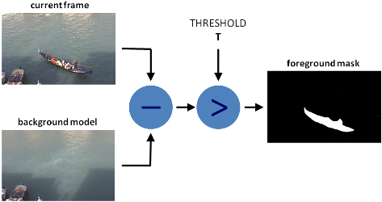

# Background Subtraction
Background subtraction is process for creating a foreground mask. Removes the background (static objects) and keeps only the moving objects in frame.

  

Code and notes from various tutorials. See the [Links](#links) section.

## The Process for doing it from scratch
1. The camera is not moving, it is pointed at a road with moving cars. We want to show only the moving cars
2. We first do background estimation, where we find what the background looks like (the road) without any moving cars:
   - Every pixel sees the same piece of the background because the camera is not moving. Occasionally, a moving car obscures the background.
   - We randomly sample a few frames from the video to get estimates of the background. As long as a pixel is not covered by a moving car more than 50% of the time, the median of the pixel over these sample frames will give a good estimate of the background at that pixel.
   - We can repeat this for every pixel and recover the entire background.
3. Now we do background subtraction (now we show only the cars). We can create a mask for every frame which shows parts of the image that are in motion.
   - Convert the median frame to grayscale.
   - Loop over all frames in the video. Extract the current frame and convert it to grayscale.
   - Calculate the absolute difference between the current frame and the median frame.
   - Threshold the above image to remove noise and binarize the output (convert image to black and white).
4. Done!

See `background_subtraction.py`.

## Built in methods
It becomes more complicated when there are shadows of the vehicles. Since shadows also move, simple subtraction will mark that also as foreground. It complicates things. Several algorithms were introduced for this purpose. 

### BackgroundSubtractorMOG
It is a Gaussian Mixture-based Background/Foreground Segmentation Algorithm. It uses a method to model each background pixel by a mixture of K Gaussian distributions. The weights of the mixture represent the time proportions that those colours stay in the scene. The probable background colours are the ones which stay longer and more static.

While coding, we need to create a background object using the function, cv.bgsegm.createBackgroundSubtractorMOG(). It has some optional parameters like length of history, number of gaussian mixtures, threshold etc. Then inside the video loop, use backgroundsubtractor.apply() method to get the foreground mask.

See `background_subtraction_mog.py`.

### BackgroundSubtractorGMG
This algorithm combines statistical background image estimation and per-pixel Bayesian segmentation. It uses the first few frames for background modelling. It uses probabilistic foreground segmentation algorithm that identifies possible foreground objects using Bayesian inference. The estimates are adaptive; newer observations are more heavily weighted than old observations to accommodate variable illumination. Several morphological filtering operations like closing and opening are done to remove unwanted noise. You will get a black window during first few frames.

See `background_subtraction_gmg.py`.

### BackgroundSubtractor MOG2 or KNN
Other (more common and newer) methods are MOG2 and KNN.

See `background_subtraction_mog2_knn.py`.

## Links
- [Background Estimation | LearnOpenCV](https://learnopencv.com/simple-background-estimation-in-videos-using-opencv-c-python/)
- [Background Subtraction - Methods built into OpenCV](https://docs.opencv.org/3.4/d8/d38/tutorial_bgsegm_bg_subtraction.html)
- [Background Subtraction - Updated OpenCV Docs](https://docs.opencv.org/3.4/d1/dc5/tutorial_background_subtraction.html)